<p align="center">
  
</p>

<p align="center">
  <strong>EXIF metadata viewer for photographers — drag a photo in, see every camera setting, instantly.</strong>
</p>

<p align="center">
  <a href="https://dacameragirl.github.io/exif-lens/"></a>
  <a href="https://github.com/DaCameraGirl/exif-lens"></a>
  <a href="https://github.com/DaCameraGirl"></a>
</p>

<p align="center">
  
  
  
</p>

### Languages

<p align="center">
  
  
</p>

### Stack

<p align="center">
  
  
  
  
  
</p>

<p align="center">
  Built by <strong>Angela Hudson</strong> · <a href="https://github.com/DaCameraGirl">DaCameraGirl</a>
</p>

# 📸 EXIF Lens

<p align="center">
  <a href="https://dacameragirl.github.io/exif-lens/"></a>
  
  
  
</p>

<p align="center">
  <em>Drop a photo → aperture, shutter, ISO, lens, GPS, and the rest. No account. No server. No nonsense.</em>
</p>

<p align="center"></p>
<p align="center"></p>

**Live:** [dacameragirl.github.io/exif-lens](https://dacameragirl.github.io/exif-lens/)

Drag a photo onto the page (or paste from clipboard) and get a full camera readout — body, lens, exposure triangle, flash, white balance, metering, GPS map, and every raw EXIF tag if you want to dig deeper.

Everything runs in your browser. Your files never leave your machine.

<p align="center"></p>
<p align="center"></p>

| Feature | What you get |
| --- | --- |
| 🎯 **Drag & drop** | Drop one or many photos, or paste from clipboard |
| 📷 **Full EXIF readout** | Camera, lens, aperture, shutter, ISO, focal length, flash, WB, metering, and more |
| 🗺️ **GPS map** | Pin on OpenStreetMap + link out to Google Maps |
| 🧹 **Strip EXIF** | One-click clean download before posting online |
| 📦 **Batch / filmstrip** | Flip through multiple shots like a contact sheet |
| 📋 **Copy JSON** | Grab the raw metadata blob |
| 🎨 **Dark UI** | Photographer-focused — no blinding white backgrounds |

<p align="center"></p>
<p align="center"></p>

<p align="center">
  
  
  
  
  
  
</p>

<p align="center"></p>
<p align="center"></p>

```bash
npm install
npm run dev
```

Open [http://localhost:3000](http://localhost:3000)

Production build (GitHub Pages export):

```bash
GITHUB_PAGES=true npm run build
```

Static output lands in `out/`.

<p align="center"></p>
<p align="center"></p>

Photos are parsed entirely client-side with **exifr**. Nothing gets uploaded to a server — ever.

Use **Strip EXIF & save** before sharing if you want to scrub GPS coordinates and camera metadata from a shot.

<p align="center"></p>
<p align="center"></p>

<p align="center">
  <strong>EXIF Lens</strong> — see what your camera saw.<br/>
  MIT · <a href="https://github.com/DaCameraGirl/exif-lens">github.com/DaCameraGirl/exif-lens</a>
</p>